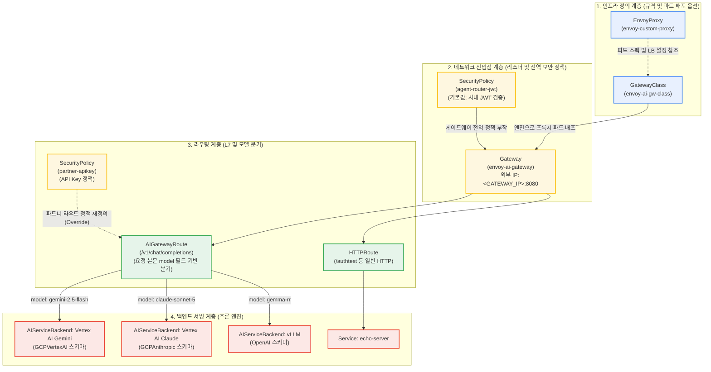

# 게이트웨이 및 리소스 계층 구조

Kubernetes Gateway API, Envoy Gateway, Envoy AI Gateway([Agentrouter](https://github.com/theagentrouter/agent-router)) 리소스의 계층 구조와 동작 방식을 설명합니다.

***

## 1. 리소스 관계 및 계층 다이어그램



***

## 2. 리소스별 역할 및 매핑

| 리소스 종류 | 역할 | 배포 리소스명 | 매니페스트 경로 |
| --- | --- | --- | --- |
| `GatewayClass` | 클러스터에 설치된 인그레스 컨트롤러 엔진을 지정합니다. | `envoy-ai-gw-class` | [`manifests/01-gateway/gateway-class.yaml`](https://github.com/seoeunbae/agentrouter-multi-llm-gcp/blob/main/manifests/01-gateway/gateway-class.yaml) |
| `EnvoyProxy` | 데이터 플레인 Envoy 파드의 CPU·메모리, 복제본 수, 로깅 레벨, 외부 LoadBalancer 옵션을 정의합니다. | `routing/envoy-custom-proxy` | [`manifests/01-gateway/envoy-proxy.yaml`](https://github.com/seoeunbae/agentrouter-multi-llm-gcp/blob/main/manifests/01-gateway/envoy-proxy.yaml) |
| `Gateway` | 외부 트래픽을 수신하는 진입점입니다. 포트(8080)를 열고 GCP 외부 LoadBalancer IP를 할당받습니다. | <p><code>routing/envoy-ai-gateway</code><br>(외부 IP: <code>&#x3C;GATEWAY_IP></code>)</p> | [`manifests/01-gateway/gateway.yaml`](https://github.com/seoeunbae/agentrouter-multi-llm-gcp/blob/main/manifests/01-gateway/gateway.yaml) |
| `SecurityPolicy` | Gateway 또는 Route에 연결되어 JWT 서명 검증, API Key 인증, 테넌트 헤더 주입을 수행합니다. | <p><code>routing/agent-router-jwt</code><br><code>routing/partner-apikey</code></p> | <p><a href="https://github.com/seoeunbae/agentrouter-multi-llm-gcp/blob/main/manifests/02-security/security-policy.yaml"><code>manifests/02-security/security-policy.yaml</code></a><br><a href="https://github.com/seoeunbae/agentrouter-multi-llm-gcp/blob/main/manifests/05-routing/partner-route.yaml"><code>manifests/05-routing/partner-route.yaml</code></a></p> |
| `HTTPRoute` | URL 경로(`/authtest`)나 헤더 기준으로 일반 K8s Service로 트래픽을 전달합니다. | `routing/authtest` | [`manifests/05-routing/echo-route.yaml`](https://github.com/seoeunbae/agentrouter-multi-llm-gcp/blob/main/manifests/05-routing/echo-route.yaml) |
| `AIGatewayRoute` | HTTP 요청 본문(JSON)에서 `model` 필드를 읽어 대상 AI 백엔드로 분기합니다. | <p><code>routing/envoy-ai-gw-router</code><br><code>routing/partner-router</code></p> | <p><a href="https://github.com/seoeunbae/agentrouter-multi-llm-gcp/blob/main/manifests/05-routing/ai-gateway-route.yaml"><code>manifests/05-routing/ai-gateway-route.yaml</code></a><br><a href="https://github.com/seoeunbae/agentrouter-multi-llm-gcp/blob/main/manifests/05-routing/partner-route.yaml"><code>manifests/05-routing/partner-route.yaml</code></a></p> |
| `AIServiceBackend` | 백엔드 프로토콜 스키마(OpenAI, GCPVertexAI, GCPAnthropic)와 요청 변환 방식을 정의합니다. | <p><code>routing/vertex-ai-backend</code><br><code>routing/vertex-ai-claude-backend</code><br><code>routing/vllm-rr-backend</code><br><code>routing/partner-vllm-backend</code></p> | <p><a href="https://github.com/seoeunbae/agentrouter-multi-llm-gcp/blob/main/manifests/05-routing/ai-gateway-route.yaml"><code>manifests/05-routing/ai-gateway-route.yaml</code></a><br><a href="https://github.com/seoeunbae/agentrouter-multi-llm-gcp/blob/main/manifests/05-routing/partner-route.yaml"><code>manifests/05-routing/partner-route.yaml</code></a></p> |

***

## 3. 요청 처리 흐름

클라이언트가 `http://<GATEWAY_IP>:8080/v1/chat/completions`로 요청을 보낼 때의 처리 순서입니다.

```
[클라이언트]
   │
   │  1. HTTP POST /v1/chat/completions (헤더: Authorization Bearer JWT)
   ▼
[Gateway: envoy-ai-gateway (<GATEWAY_IP>:8080)]
   │
   │  2. SecurityPolicy 검증:
   │     - JWT 서명 검증 (Google/GCIP 공개키 대조)
   │     - 토큰 클레임 추출 후 x-tenant-id 헤더 주입
   ▼
[AIGatewayRoute: envoy-ai-gw-router]
   │
   │  3. 요청 본문(Body) 버퍼링 및 모델 파싱:
   │     - JSON 파싱으로 model 값 확인
   │
   ├─ model == "gemini-2.5-flash" ──┐
   │                                 │
   ├─ model == "claude-sonnet-5" ───┼─┐
   │                                 │ │
   └─ model == "gemma-rr" ───┐       │ │
                             │       ▼ │
                             │  [AIServiceBackend: vertex-ai-backend]
                             │     - OpenAI 규격 요청을 Vertex AI Gemini 규격으로 변환
                             │     - BackendSecurityPolicy 자격증명으로 Google OAuth2 토큰 생성
                             │     - Vertex AI Gemini 호출
                             │
                             │       ▼
                             │  [AIServiceBackend: vertex-ai-claude-backend]
                             │     - OpenAI/Anthropic 규격 요청을 Vertex AI Claude 규격으로 변환
                             │     - BackendSecurityPolicy 자격증명으로 Google OAuth2 토큰 생성
                             │     - Vertex AI Anthropic Claude 호출
                             │
                             ▼
                        [AIServiceBackend: vLLM / InferencePool]
                           - 내부 GPU 노드의 vLLM 파드로 전달
```

***

## 4. 정책 상속 및 재정의(Override) 규칙

Gateway API Policy Attachment 규칙에 따라 상위·하위 계층 정책이 적용됩니다.

1. Gateway 계층 정책 (`agent-router-jwt`):
   * `targetRefs`가 `Gateway`를 가리킵니다.
   * 하위 라우트는 기본적으로 사내 JWT 인증을 상속받아 비인가 노출을 방지합니다.
2. HTTPRoute 계층 정책 (`partner-apikey`):
   * `targetRefs`가 특정 라우트(`partner-router`)를 가리킵니다.
   * 하위 계층(Route) 정책이 상위 계층(Gateway) 정책을 덮어씁니다.
   * 파트너 전용 도메인 요청은 JWT 검증 대신 API Key 검증만 수행합니다.
