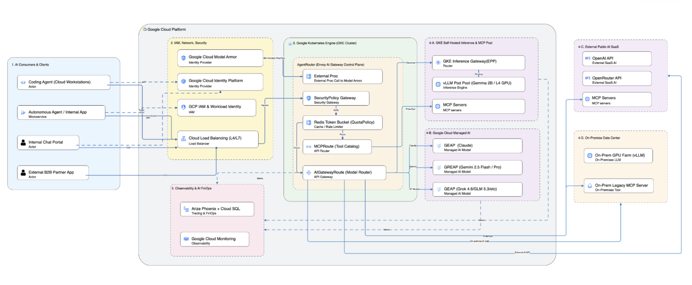
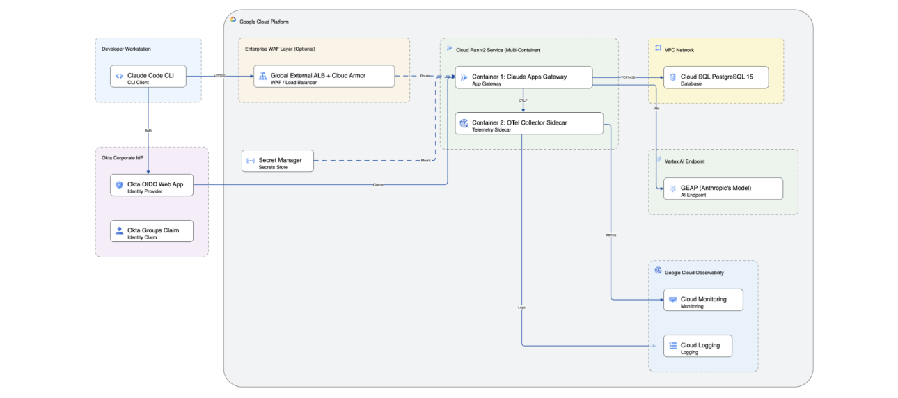
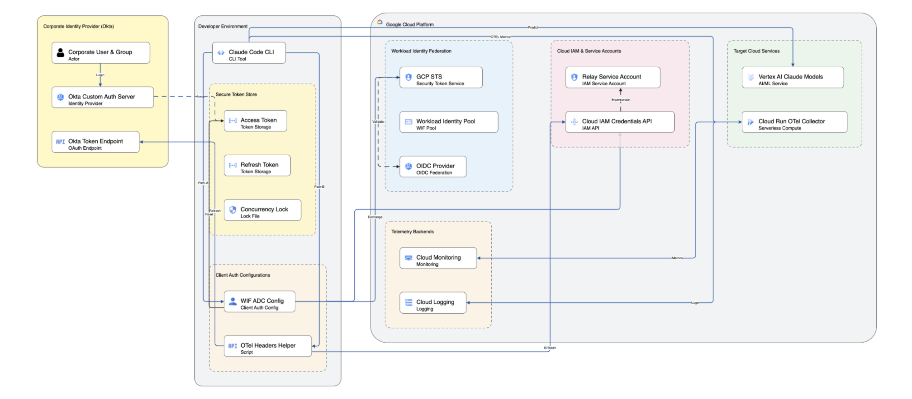
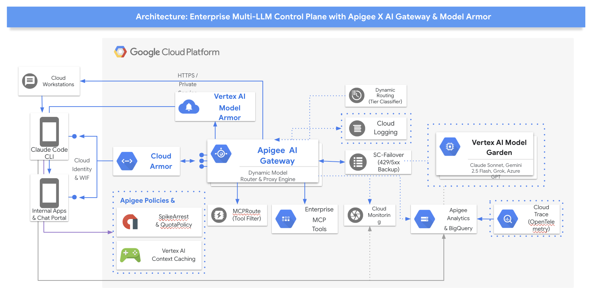

# 아키텍처 개요

Google Kubernetes Engine(GKE) 환경에서 [**Agentrouter (formerly Envoy AI Gateway)**](https://github.com/theagentrouter/agent-router)(`v1.1.0`), **Kubernetes Gateway API Inference Extension(GIE `v1.6.0`)**, **llm-d-router(`EPP v0.10.0`)**, **vLLM**, **Google Cloud Model Armor & Cloud DLP** 및 **Vertex AI**를 결합한 엔터프라이즈 멀티 LLM 서빙 플랫폼입니다.

***

## 문서 바로가기

### 시작하기
* [빠른 시작 및 배포](../getting-started-ko/quickstart.md): `make deploy` 명령 한 줄로 GKE, L4 GPU, Cloud SQL, GCS 인프라와 AI 게이트웨이 전체 스택을 배포합니다.
* [고객 워크숍 가이드](../getting-started-ko/workshop-guide.md): IAM 권한, GPU 쿼터 점검, 3대 다계층 인증, EPP 접두사 캐시, Model Armor 가드레일, Phoenix 관측성까지 단계별 실습을 안내합니다.

### 아키텍처 & 설계
* [게이트웨이 및 리소스 계층 구조](../architecture-ko/gateway-resources.md): Kubernetes Gateway API 리소스 계층 구조와 라우팅·정책 연결 관계를 확인합니다.
* [엔드투엔드 요청 처리 흐름](../architecture-ko/request-flow.md): 사내 임직원, 내부 마이크로서비스, 외부 파트너 페르소나별 엔드투엔드 시퀀스 다이어그램을 확인합니다.
* [프로젝트 설계 명세](../architecture-ko/project-spec.md): 전체 기능 인벤토리, 마일스톤 검증 매트릭스 및 컴포넌트 간 인터페이스 계약을 정의합니다.

### 검증 & 운영 가이드
* [수동 테스트 가이드](../operations-ko/manual-test-guide.md): 시나리오별 수동 검증 절차와 점검 명령어를 제공합니다.
* [Claude Code & Vertex AI 호환성 가이드](../operations-ko/claude-code-compatibility.md): Claude Code의 실험적 베타 헤더(`advisor-tool-2026-03-01`)와 Vertex AI 간 호환성 원인과 해결 방안을 안내합니다.

***

## 1. 아키텍처 개요

본 플랫폼은 퍼블릭 클라우드 관리형 모델(**Vertex AI Gemini**, **Anthropic Claude**)과 자체 호스팅 모델(**vLLM Gemma 2B**)을 단일 진입점으로 통합 제공합니다.

* **인프라 계층**: GKE Standard 클러스터, 2대의 NVIDIA L4 GPU Spot 노드풀(`g2-standard-8`), Cloud SQL PostgreSQL 16 인스턴스 및 Cloud Storage 버킷으로 구성됩니다.
* **모델 서빙 계층**: Cloud Storage FUSE 드라이버로 모델 가중치를 컨테이너에 직접 마운트합니다. vLLM `v0.29.0` 엔진으로 구동되며 PagedAttention V1 접두사 캐싱(Prefix Caching)을 활성화합니다.
* **지능형 라우팅 계층**: [Agentrouter (formerly Envoy AI Gateway)](https://github.com/theagentrouter/agent-router)가 수신 요청 본문(JSON)을 버퍼링한 뒤 `model` 필드를 파싱하여 최적 백엔드로 분기합니다. Kubernetes GIE 규격 `InferencePool`과 `llm-d-router`(EPP) 접두사 스코어러를 연계해 캐시 친화적인 GPU 파드로 요청을 유도합니다.
* **다계층 보안 및 인가 계층**: 사내 임직원용 GCIP JWT, 내부 서비스용 Google SA ID 토큰, 외부 파트너용 API Key 인증을 게이트웨이 레벨에서 단일 처리하며, Google Cloud Model Armor 및 Sensitive Data Protection(Cloud DLP) 가드레일(`08-model-armor`)을 제공합니다.
* **트래픽 제어 계층**: Redis 기반 분산 카운터를 활용해 토큰 단위 속도 제한(`BackendTrafficPolicy`)과 파트너별 토큰 예산 격리(`QuotaPolicy`)를 동시에 집행합니다.
* **관측성 계층**: [Arize Phoenix](https://github.com/Arize-ai/phoenix)를 Cloud SQL 백엔드와 연동하여 OTLP 트레이스를 영구 적재한 뒤 Google Cloud Monitoring으로 GPU 및 접두사 캐시 지표를 실시간 수집합니다.

### 1.1 레퍼런스 아키텍처 (Reference Architectures)

#### Reference Architecture: AgentRouter Multi-LLM on GCP

#### Reference Architecture: Claude Apps Gateway on GCP

#### Reference Architecture: Claude Code with IdP (Okta)

#### Reference Architecture: AI Gateway with Apigee, Model Armor

상세 아키텍처 및 컴포넌트 흐름은 다음 문서를 참고하십시오.

* [게이트웨이 및 리소스 계층 구조 다이어그램](../architecture-ko/gateway-resources.md)
* [시나리오별 엔드투엔드 요청 처리 시퀀스](../architecture-ko/request-flow.md)
* [프로젝트 설계 명세 및 기능 인벤토리](../architecture-ko/project-spec.md)

***

## 2. 라우팅 경로 및 모델 지원

게이트웨이 진입점(`http://<GATEWAY_IP>:8080/v1/chat/completions`)으로 요청이 들어오면 `model` 값에 따라 다음 백엔드로 분기됩니다.

| 모델 식별자               | 서빙 위치                  | 백엔드 스키마        | 처리 방식                               |
| -------------------- | ---------------------- | -------------- | ----------------------------------- |
| `gemini-2.5-flash`   | Google Cloud Vertex AI | `GCPVertexAI`  | 게이트웨이가 GCP 자격증명으로 대리 호출             |
| `claude-sonnet-5`    | Google Cloud Vertex AI | `GCPAnthropic` | OpenAI 규격 및 네이티브 Messages API 동시 지원 |
| `gemma-rr`           | GKE 사내 GPU 클러스터        | `OpenAI`       | K8s Service 기반 순수 L4 라운드로빈 전달       |
| `gemma-epp`          | GKE 사내 GPU 클러스터        | `OpenAI`       | GIE EPP 접두사 캐시 스코어러 기반 최적 파드 유도     |
| `gemma-epp-noprefix` | GKE 사내 GPU 클러스터        | `OpenAI`       | GIE EPP 대기열 큐 스코어러 기반 부하 분산         |

***

## 3. 3대 다계층 인증 체계

조직 안팎의 다양한 클라이언트 요구사항을 충족하기 위해 3단계 인증 관문을 제공합니다.

### 3.1 사내 임직원 및 Cloud Workstation (GCIP JWT)

* 사내 IdP(Identity Platform)에서 발급한 JWT 서명을 게이트웨이가 Google 공개키 JWKS로 직접 검증합니다.
* 토큰 페이로드의 `department` 클레임을 추출하여 백엔드 `x-tenant-id` 헤더로 자동 주입합니다.
* 클라이언트가 임의로 전송한 테넌트 헤더를 덮어써 부서 신원 위조를 원천 방어합니다.
* Cloud Workstation 상의 Claude Code CLI 도구와 투명하게 연동됩니다.

### 3.2 내부 마이크로서비스 (Google SA ID 토큰)

* GKE 내부 파드가 정적 키 파일 없이 Workload Identity 메타데이터로 발급받은 Google SA ID 토큰을 검증합니다.
* 게이트웨이가 토큰의 `email` 클레임을 읽어 서비스 계정 주소로 `x-tenant-id` 헤더를 설정합니다.

### 3.3 외부 파트너 서비스 (API Key 및 쿼터 격리)

* 파트너 전용 도메인(`partner.agent-router.internal`)으로 인입되는 요청을 대상으로 전용 `SecurityPolicy`를 적용합니다.
* 사전에 등록된 API Key를 대조하여 호출 주체를 식별한 뒤 `x-tenant-id` 헤더를 주입하고 백엔드 노출을 막기 위해 API Key 헤더를 제거합니다.
* 파트너는 인가된 `gemma-rr` 모델만 호출할 수 있고 고비용 모델(`claude-sonnet-5`) 호출 시 `HTTP 404 Route Not Found`로 차단됩니다.
* Key Issuer 서비스를 이용해 신규 파트너 API Key를 실시간 발급하고 K8s Secret에 즉시 동기화합니다.

보안 헤더 위조 방어 동작은 `/authtest` 에코 엔드포인트로 검증할 수 있습니다.

***

## 4. 트래픽 제어 및 쿼터 정책

엔터프라이즈 환경에서 비용 폭증을 방지하고 테넌트 간 공정한 자원 배분을 구현합니다.

* **사용량 기반 속도 제한 (`BackendTrafficPolicy`)**:
  * `claude-sonnet-5` 모델 호출을 대상으로 분당 500,000 토큰 한도를 제어합니다.
  * 응답 헤더 메타데이터(`llm_total_token`)를 읽어 Redis 분산 카운터에 실시간 반영합니다.
* **테넌트별 차등 쿼터 정책 (`QuotaPolicy`)**:
  * 외부 파트너를 위해 독립된 토큰 예산 버킷을 제공합니다.
  * `acme-corp`는 분당 60토큰, `globex`는 분당 500토큰 한도를 부여받습니다.
  * `acme-corp`가 60토큰을 소진하여 `HTTP 429`로 차단된 상태에서도 `globex`는 독립된 버킷을 유지하여 정상 응답(`HTTP 200`)을 받습니다.

***

## 5. 3대 라우팅 방식 비교 실측 벤치마크 결과

GKE Standard 환경에서 NVIDIA L4 GPU 2대, vLLM `v0.29.0`(`google/gemma-2-2b-it`), 16개 독립 페르소나 프롬프트(요청당 약 2,000 토큰)를 사용하여 실측한 벤치마크 결과입니다. 측정 간 캐시 오염을 막기 위해 각 라우팅 방식 측정 전 vLLM 파드를 재기동하여 캐시를 초기화했습니다.

### 5.1 지연시간 및 캐시 적중 통계

| 라우팅 구성 대상                | 라우팅 구성 방식                       | 1차 Cold TTFT P50 | 2차 Eval TTFT P50 | Eval P95   | Eval P99   | 캐시 적중 토큰 수 |
| ------------------------ | ------------------------------- | ---------------- | ---------------- | ---------- | ---------- | ---------- |
| **`gemma-epp`**          | InferencePool + EPP 접두사 스코어러 ON | 0.773s           | **0.139s**       | **0.178s** | **0.191s** | **25,184** |
| **`gemma-rr`**           | K8s Service 순수 L4 라운드로빈         | 1.351s           | 0.613s           | 1.829s     | 1.877s     | 10,560     |
| **`gemma-epp-noprefix`** | InferencePool + EPP 대기열 큐 스코어러  | 0.807s           | 0.251s           | 0.590s     | 0.644s     | 15,520     |

### 5.2 주요 분석 결과

* **접두사 캐시 가속 효과**: `gemma-epp`는 1차 Cold(`0.773s`) 대비 2차 Eval(`0.139s`)에서 **5.55배 지연시간 단축**을 기록했습니다.
* **접두사 스코어러 순이득**: 일반 대기열 분산(`gemma-epp-noprefix`, `0.251s`) 대비 접두사 스코어러 적용 시 지연시간이 **44.6% 단축**(`0.112s` 단축)되었습니다.
* **캐시 편중 방지 및 적중량 확대**: 순수 라운드로빈(`gemma-rr`)은 특정 파드에만 캐시 적중이 쏠리고 다른 파드는 0건을 기록하여 꼬리 지연시간(`Eval P99: 1.877s`)이 치솟았습니다. 반면 `gemma-epp`는 두 파드 모두 `49.8%` 수준으로 고르게 캐시를 분산 적중시켜 총 25,184 토큰(순수 라운드로빈 대비 **2.38배**)을 적중시켰습니다.
* **보안 필터 무영향 검증**: Gateway 레벨에서 JWT 서명 검증 필터가 동작함에도 불구하고 `gemma-epp`의 Eval P50은 `0.139s`로 인증 도입 전 기준선(`0.148s`) 대비 성능 저하가 없었습니다.

***

## 6. 엔터프라이즈 관측성

* [**Arize Phoenix**](https://github.com/Arize-ai/phoenix): Cloud SQL PostgreSQL 16과 Cloud SQL Auth Proxy로 연동됩니다. OTLP OpenInference 규격 트레이스를 영구 적재하고 웹 UI(`:6006`)에서 입출력 토큰, 소요 시간, 레이턴시 구간을 분석할 수 있습니다.
* **Google Cloud Monitoring**: `PodMonitoring` 리소스로 vLLM 파드의 프로메테우스 지표(`:8000/metrics`)를 스크랩합니다. 실시간 접두사 캐시 적중률과 TTFT 지표가 포함된 대시보드를 제공합니다.
