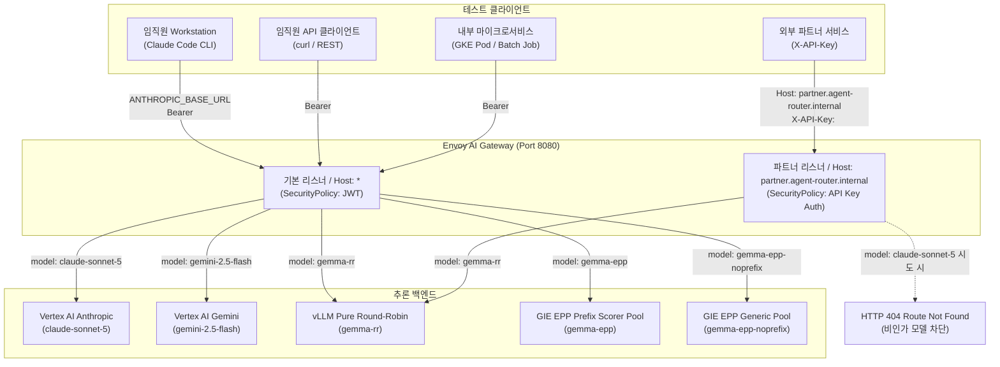

# 수동 테스트 가이드

GKE에 배포된 Envoy AI Gateway(Agent Router), vLLM, GIE/EPP(llm-d-router), 다계층 인증(GCIP, Workload Identity, API Key), 파트너 쿼터 격리, Arize Phoenix 관측성 파이프라인의 수동 검증 절차를 설명합니다.

***

## 0. 테스트 아키텍처 및 경로

단일 게이트웨이 엔드포인트에서 클라이언트 유형과 요청 조건에 따라 트래픽을 분기하고 인가를 수행합니다.



***

## 1. 환경 변수 설정

로컬 셸 환경에서 아래 변수를 설정합니다.

```bash
# 게이트웨이 외부 접속 주소
export GW="http://$(kubectl get gateway envoy-ai-gateway -n routing -o jsonpath='{.status.addresses[0].value}' 2>/dev/null || echo <GATEWAY_IP>):8080"
export PARTNER_HOST="partner.agent-router.internal"
export GCP_PROJECT="${GCP_PROJECT:-<YOUR_PROJECT_ID>}"

# 공인 IP 직접 접근이 제한된 경우 포트포워딩 실행
# kubectl port-forward -n envoy-gateway-system svc/envoy-routing-envoy-ai-gateway-add85b85 8080:8080 &
# export GW="http://localhost:8080"
```

***

## 2. 시나리오 1: 사내 임직원 환경 (Cloud Workstation Claude Code)

Cloud Workstation에서 `claude` CLI를 사용할 때 게이트웨이가 GCIP 토큰을 검증한 뒤 Vertex AI의 `claude-sonnet-5`로 전달하는 과정을 확인합니다.

### 2.1 워크스테이션 접속 및 설정 확인

1. Cloud Workstation 인스턴스에 SSH로 접속합니다.

   ```bash
   gcloud workstations ssh <YOUR_WORKSTATION_NAME> \
     --project=$GCP_PROJECT \
     --region=asia-northeast3 \
     --cluster=<YOUR_WORKSTATION_CLUSTER> \
     --config=<YOUR_WORKSTATION_CONFIG>
   ```
2. Claude Code 설정을 확인합니다.

   ```bash
   cat ~/.claude/settings.json
   ```

   기대 설정값:

   * `"ANTHROPIC_BASE_URL": "http://<GATEWAY_IP>:8080/anthropic"`
   * `"apiKeyHelper": "/home/user/bin/gcip-token.sh alice platform"`
   * `"ANTHROPIC_MODEL": "claude-sonnet-5"`
   * `"model": "claude-sonnet-5"`
   * `"CLAUDE_CODE_DISABLE_EXPERIMENTAL_BETAS": "1"` (미지원 베타 헤더 주입 비활성화)
   * `CLAUDE_CODE_USE_VERTEX` 환경 변수가 없어야 합니다 (설정 시 게이트웨이 주소를 무시합니다).
   * `env.ANTHROPIC_AUTH_TOKEN`이 없어야 합니다 (설정 시 `apiKeyHelper`가 무시됩니다).

### 2.2 프롬프트 실행

1. 단발성 질의를 실행합니다.

   ```bash
   claude -p '안녕! 3단어로 답해줘'
   ```

   * 기대 결과: 2~4초 내 정상 응답 출력
2. 연속 호출을 실행해 속도 제한(분당 50만 토큰) 범위 내에서 정상 처리되는지 확인합니다.

   ```bash
   claude -p 'say OK 1' && claude -p 'say OK 2'
   ```

   * 기대 결과: 두 요청 모두 429 오류 없이 성공

### 2.3 게이트웨이 로그 확인

Envoy 액세스 로그에서 요청이 Vertex AI로 전달되었는지 확인합니다.

```bash
kubectl logs -n envoy-gateway-system \
  -l gateway.envoyproxy.io/owning-gateway-name=envoy-ai-gateway \
  --tail=5
```

* 확인 항목:
  * `user-agent`: `claude-cli/...`
  * `response_code`: `200`
  * `x-envoy-origin-path`: `/v1/projects/<YOUR_PROJECT_ID>/locations/global/publishers/anthropic/models/claude-sonnet-5:streamRawPredict`

***

## 3. 시나리오 2: 사내 임직원 REST API 호출 (curl)

REST API로 직접 모델을 호출하고, 게이트웨이가 테넌트 헤더 위조를 차단하는지 확인합니다.

### 3.1 GCIP ID 토큰 발급

`scripts/gcip-token.sh`로 1시간 유효한 GCIP ID 토큰을 발급합니다.

```bash
# 사용자 alice, 부서 platform 토큰 발급
export GT=$(./scripts/gcip-token.sh alice platform)
echo "토큰 길이: ${#GT}"
```

### 3.2 Vertex AI Claude 호출 (OpenAI 규격)

```bash
curl -sS -X POST "$GW/v1/chat/completions" \
  -H "Authorization: Bearer $GT" \
  -H "Content-Type: application/json" \
  -d '{
    "model": "claude-sonnet-5",
    "messages": [{"role": "user", "content": "Explain Rate Limiting in 10 words."}],
    "max_tokens": 30
  }' | jq .
```

* 기대 결과: HTTP `200 OK`, `model` 필드에 `claude-sonnet-5` 표시

### 3.3 Vertex AI Claude 호출 (Anthropic Messages 규격)

```bash
curl -sS -X POST "$GW/anthropic/v1/messages" \
  -H "Authorization: Bearer $GT" \
  -H "Content-Type: application/json" \
  -d '{
    "model": "claude-sonnet-5",
    "messages": [{"role": "user", "content": "Say OK"}],
    "max_tokens": 10
  }' | jq .
```

* 기대 결과: HTTP `200 OK`, `type` 필드에 `message`, `content[0].text`에 응답 표시

### 3.4 Vertex AI Gemini 2.5 Flash 호출

```bash
curl -sS -X POST "$GW/v1/chat/completions" \
  -H "Authorization: Bearer $GT" \
  -H "Content-Type: application/json" \
  -d '{
    "model": "gemini-2.5-flash",
    "messages": [{"role": "user", "content": "Kubernetes Gateway API 장점을 한 줄로 요약해줘."}],
    "max_tokens": 1500
  }' | jq .
```

* 기대 결과: HTTP `200 OK`. 클라이언트의 `Authorization: Bearer $GT`는 게이트웨이 인증에만 사용되며, Vertex AI 호출 시에는 게이트웨이의 `BackendSecurityPolicy` 자격증명이 사용됩니다.

### 3.5 보안 검증: 클라이언트 헤더 위조 방지 (`x-tenant-id` 덮어쓰기)

> [!NOTE] `/authtest`는 게이트웨이가 백엔드로 전달하는 최종 HTTP 헤더를 확인하기 위해 에코 서버(`mendhak/http-https-echo`)와 `HTTPRoute/authtest`([echo-route.yaml](https://github.com/seoeunbae/agentrouter-multi-llm-gcp/blob/main/manifests/05-routing/echo-route.yaml))로 구성한 테스트용 엔드포인트입니다.

클라이언트가 임의로 `x-tenant-id: finance-vip` 헤더를 보내더라도 JWT 클레임(`department: platform`)으로 덮어쓰는지 확인합니다.

```bash
curl -sS -X POST "$GW/authtest" \
  -H "Authorization: Bearer $GT" \
  -H "x-tenant-id: finance-vip" \
  -H "Content-Type: application/json" \
  -d '{}' | jq .headers
```

* 기대 결과: 응답 헤더의 `"x-tenant-id"`가 `"platform"`으로 표시됩니다.

***

## 4. 시나리오 3: 내부 마이크로서비스 인증 (Google SA 토큰)

GKE 워크로드가 정적 키 없이 Workload Identity SA ID 토큰으로 사내 모델(`gemma-rr`)을 호출하는 과정을 확인합니다.

### 4.1 SA ID 토큰 발급 및 호출

로컬 터미널에서는 서비스 계정 가장(impersonation)으로 토큰을 생성해 호출합니다.

```bash
# Google SA ID 토큰 발급 (Audience 지정 및 email 포함)
export SA_EMAIL="${SA_EMAIL:-<YOUR_SERVICE_ACCOUNT>@${GCP_PROJECT}.iam.gserviceaccount.com}"
export SA_TOKEN=$(gcloud auth print-identity-token \
  --impersonate-service-account="$SA_EMAIL" \
  --audiences=https://agent-router.internal \
  --include-email 2>/dev/null)

# Gemma 2B 모델 호출
curl -sS -X POST "$GW/v1/chat/completions" \
  -H "Authorization: Bearer $SA_TOKEN" \
  -H "Content-Type: application/json" \
  -d '{
    "model": "gemma-rr",
    "messages": [{"role": "user", "content": "Healthcheck from microservice"}],
    "max_tokens": 15
  }' | jq .
```

* 기대 결과: HTTP `200 OK`, `system_fingerprint`에 `vllm-0.29.0` 표시

### 4.2 Google SA 이메일 헤더 주입 확인 (`/authtest`)

토큰의 `email` 클레임이 `x-tenant-id` 헤더로 주입되는지 확인합니다.

```bash
curl -sS -X POST "$GW/authtest" \
  -H "Authorization: Bearer $SA_TOKEN" \
  -H "Content-Type: application/json" \
  -d '{}' | jq .headers
```

* 기대 결과: `"x-tenant-id"`에 서비스 계정 이메일(`$SA_EMAIL`)이 표시됩니다.

***

## 5. 시나리오 4: 외부 파트너 연동 (API Key 및 쿼터 격리)

외부 파트너가 API Key로 접근할 때 허용된 모델만 호출할 수 있고, 파트너별 분당 토큰 한도가 격리되는지 확인합니다.

### 5.1 배포된 파트너 API Key 확인

```bash
export AK=$(kubectl get secret partner-api-keys -n routing -o jsonpath='{.data.acme-corp}' | base64 -d)
export GK=$(kubectl get secret partner-api-keys -n routing -o jsonpath='{.data.globex}' | base64 -d)

echo "Acme Corp 키: $AK"
echo "Globex 키:    $GK"
```

### 5.2 Key Issuer로 신규 키 발급 테스트

`keyissuer` 서비스로 새 파트너 키를 발급합니다.

```bash
kubectl exec -n routing deploy/keyissuer -- python3 /app/client.py | jq .
```

* 기대 결과: `{"client_id": "partner-...", "api_key": "pk-partner-...", "status": "success"}` 반환 및 K8s Secret `partner-api-keys` 자동 업데이트

### 5.3 파트너 추론 호출 (`gemma-rr`)

파트너 전용 도메인(`partner.agent-router.internal`)을 `Host` 헤더에 지정해 호출합니다.

```bash
curl -sS -X POST "$GW/v1/chat/completions" \
  -H "Host: $PARTNER_HOST" \
  -H "X-API-Key: $AK" \
  -H "Content-Type: application/json" \
  -d '{
    "model": "gemma-rr",
    "messages": [{"role": "user", "content": "Partner integration verification"}],
    "max_tokens": 16
  }' | jq .
```

* 기대 결과: HTTP `200 OK`

### 5.4 비인가 모델 차단 확인

파트너가 허용되지 않은 모델(`claude-sonnet-5`)을 요청할 때 차단되는지 확인합니다.

```bash
curl -sS -i -X POST "$GW/v1/chat/completions" \
  -H "Host: $PARTNER_HOST" \
  -H "X-API-Key: $AK" \
  -H "Content-Type: application/json" \
  -d '{
    "model": "claude-sonnet-5",
    "messages": [{"role": "user", "content": "Unauthorized request"}],
    "max_tokens": 10
  }'
```

* 기대 결과: HTTP `404 Not Found` (`No matching route found...`)

### 5.5 파트너별 쿼터 격리 확인 (`QuotaPolicy`)

* `acme-corp` 한도: 분당 60 토큰 (요청당 약 15~17 토큰 소비)
* `globex` 한도: 분당 500 토큰

1. `acme-corp` 쿼터 소진 테스트 (연속 6회 호출):

   ```bash
   for i in $(seq 1 6); do
     code=$(curl -sS -o /dev/null -w "%{http_code}" -X POST "$GW/v1/chat/completions" \
       -H "Host: $PARTNER_HOST" \
       -H "X-API-Key: $AK" \
       -H "Content-Type: application/json" \
       -d '{"model":"gemma-rr","messages":[{"role":"user","content":"Say OK please"}],"max_tokens":16}')
     echo "acme-corp 요청 #$i 결과 코드: $code"
   done
   ```

   * 기대 결과: 초반 요청은 `200 OK`, 60 토큰 초과 시점부터 `429 Too Many Requests` 반환
2. `globex` 격리 확인 (`acme-corp` 차단 직후 호출):

   ```bash
   curl -sS -i -X POST "$GW/v1/chat/completions" \
     -H "Host: $PARTNER_HOST" \
     -H "X-API-Key: $GK" \
     -H "Content-Type: application/json" \
     -d '{"model":"gemma-rr","messages":[{"role":"user","content":"Globex check"}],"max_tokens":16}'
   ```

   * 기대 결과: `acme-corp`가 차단된 상태에서도 `globex`는 독립 버킷을 사용하므로 HTTP `200 OK` 반환

***

## 6. 시나리오 5: Gemma EPP 접두사 캐시 가속 확인

긴 시스템 프롬프트(약 1,500 토큰)를 보낼 때 EPP 접두사 스코어러가 캐시를 보유한 파드로 라우팅해 TTFT를 단축하는지 확인합니다.

### 6.1 테스트 페이로드 생성

공통 문맥을 포함한 요청 파일 2개를 생성합니다.

```bash
cat << 'EOF' > /tmp/make_payload.py
import json

prefix = "This is enterprise shared context for Envoy AI Gateway and GIE testing. " * 150

req1 = {
    "model": "gemma-epp",
    "messages": [{"role": "user", "content": prefix + "\nQuestion 1: What is Gateway API?"}],
    "stream": True,
    "max_tokens": 20
}
req2 = {
    "model": "gemma-epp",
    "messages": [{"role": "user", "content": prefix + "\nQuestion 2: What is Prefix Caching?"}],
    "stream": True,
    "max_tokens": 20
}

with open('/tmp/prefix_q1.json', 'w') as f: json.dump(req1, f)
with open('/tmp/prefix_q2.json', 'w') as f: json.dump(req2, f)
print("생성 완료: /tmp/prefix_q1.json, /tmp/prefix_q2.json")
EOF
python3 /tmp/make_payload.py
```

### 6.2 TTFT 비교 측정

1. 1차 요청 (Cold Miss):

   ```bash
   curl -N -s -X POST "$GW/v1/chat/completions" \
     -H "Authorization: Bearer $GT" \
     -H "Content-Type: application/json" \
     -d @/tmp/prefix_q1.json \
     -w "\n[1차 Cold TTFT]: %{time_starttransfer}s | [전체 시간]: %{time_total}s\n"
   ```

   * 관측치: 1,500 토큰 Prefill 연산으로 TTFT 약 0.8s~1.2s 소요
2. 2차 요청 (Warm Cache Hit):

   ```bash
   curl -N -s -X POST "$GW/v1/chat/completions" \
     -H "Authorization: Bearer $GT" \
     -H "Content-Type: application/json" \
     -d @/tmp/prefix_q2.json \
     -w "\n[2차 Warm TTFT]: %{time_starttransfer}s | [전체 시간]: %{time_total}s\n"
   ```

   * 관측치: EPP가 1차 요청을 처리한 파드로 라우팅하여 TTFT가 약 0.14s 수준으로 단축
3. vLLM 파드별 캐시 메트릭 확인:

   ```bash
   for POD in $(kubectl get pods -n vllm -l app=vllm-server -o jsonpath='{.items[*].metadata.name}'); do
     echo "=== Pod: $POD ==="
     kubectl exec -n vllm $POD -c vllm -- curl -s http://localhost:8000/metrics \
       | grep -E "vllm:prefix_cache_hits_total"
   done
   ```

   * 1차 요청을 처리한 파드에서 `vllm:prefix_cache_hits_total` 값이 약 1,500 토큰 증가합니다.

***

## 7. 시나리오 6: 관측성 확인

### 7.1 Arize Phoenix 대시보드

1. Phoenix 서비스 포트포워딩을 실행합니다.

   ```bash
   kubectl port-forward -n phoenix svc/phoenix-service 6006:6006
   ```
2. 브라우저에서 `http://localhost:6006`에 접속해 `default` 프로젝트의 `Traces` 메뉴를 확인합니다.
   * 실행한 추론 요청이 OpenInference OTLP 스팬으로 기록되었는지 확인합니다.
   * 스팬 속성(`Attributes`)에서 `llm.token_count.prompt`, `llm.token_count.completion`, `Duration`을 확인합니다.

### 7.2 Google Cloud Monitoring 대시보드

1. 브라우저에서 대시보드에 접속합니다.
   * URL: `https://console.cloud.google.com/monitoring/dashboards?project=<YOUR_PROJECT_ID>` (`vLLM Model Server Monitoring` 선택)
2. 주요 차트 확인:
   * `Prefix Cache Hit Rate %`: 실시간 접두사 캐시 적중률
   * `vLLM Prefix Cache Hits & Queries`: 시간대별 캐시 적중 추이
   * `vLLM Time to First Token (TTFT) Latency`: P50 / P95 TTFT 지연시간

***

## 8. 시나리오 7: 비정상 요청 차단 확인

게이트웨이 보안 정책이 비정상 요청을 차단하는지 확인합니다.

| 테스트 유형 | 실행 명령 | 기대 응답 | 판정 기준 |
| --- | --- | --- | --- |
| 무인증 요청 | `curl -i -s -X POST $GW/v1/chat/completions -H 'Content-Type: application/json' -d '{"model":"gemma-rr"}'` | `HTTP 401 Unauthorized` | `Jwt is missing` |
| 위조 JWT 토큰 | `curl -i -s -X POST $GW/v1/chat/completions -H 'Authorization: Bearer bad-token' -d '{"model":"gemma-rr"}'` | `HTTP 401 Unauthorized` | `invalid_token` |
| 잘못된 파트너 키 | `curl -i -s -X POST $GW/v1/chat/completions -H "Host: $PARTNER_HOST" -H 'X-API-Key: wrong-key' -d '{"model":"gemma-rr"}'` | `HTTP 401 Unauthorized` | `Client authentication failed.` |
| Host 헤더 누락 | `curl -i -s -X POST $GW/v1/chat/completions -H 'X-API-Key: pk-acme-001' -d '{"model":"gemma-rr"}'` | `HTTP 401 Unauthorized` | 기본 리스너로 유입되어 `Jwt is missing` 차단 |

***

## 9. 문제 해결

1. `HTTP 429` 발생 시:
   * `claude-sonnet-5`: 분당 50만 토큰 한도 초과 여부를 확인합니다. 1분 후 초기화됩니다.
   * 파트너 호출: `acme-corp`는 분당 60토큰 한도이므로 1분 후 재시도하거나 `globex` 키를 사용합니다.
2. Workstation에서 Claude Code가 게이트웨이를 경유하지 않을 때:
   * `env | grep CLAUDE_CODE_USE_VERTEX`를 확인해 설정되어 있으면 `unset CLAUDE_CODE_USE_VERTEX`로 해제합니다.
   * `~/.claude/settings.json`의 `ANTHROPIC_BASE_URL`이 게이트웨이 주소인지 확인합니다.
3. `QuotaPolicy` 변경 사항이 즉시 반영되지 않을 때:
   * Envoy Gateway 컨트롤러를 재시작합니다.

   ```bash
   kubectl rollout restart deployment/envoy-gateway -n envoy-gateway-system
   kubectl rollout status deployment/envoy-gateway -n envoy-gateway-system --timeout=180s
   ```
4. Claude Code 호출 시 `400 Unexpected value(s) advisor-tool-2026-03-01 for the anthropic-beta header` 발생 시:
   * `~/.claude/settings.json`의 `env` 블록에 `"CLAUDE_CODE_DISABLE_EXPERIMENTAL_BETAS": "1"`을 추가하거나 `export CLAUDE_CODE_DISABLE_EXPERIMENTAL_BETAS=1`을 설정합니다.
